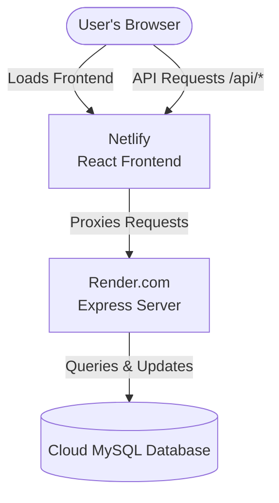

# 🚀 El Fuego — Production Deployment Guide

This guide explains how to deploy the **El Fuego** full-stack application. Since Netlify is a static hosting provider (Jamstack), it cannot run a live, stateful Express backend or a MySQL database. 

To host the full application, we will use a **hybrid architecture**:
*   **Frontend (React + Vite)**: Hosted on **Netlify** (Free).
*   **Backend (Node.js + Express)**: Hosted on **Render** (Free Web Service).
*   **Database (MySQL)**: Hosted on a cloud database provider like **Aiven**, **Clever Cloud**, or **Railway** (Free/Trial Tiers).

---

## 🗺 Architecture Diagram



---

## 🛠 Step 1: Deploy the MySQL Database

Your Express server needs a live MySQL database to fetch menu items and store reservations/messages.

### Option A: Aiven (Recommended Free Tier)
1. Go to [Aiven.io](https://aiven.io/) and create a free account.
2. Create a new project, select **MySQL** as the service, and choose the **Free Tier**.
3. Select your preferred cloud provider and region (e.g., AWS or GCP near you).
4. Once the service is running, copy the connection details:
   *   **Host**
   *   **Port**
   *   **User** (usually `avnadmin`)
   *   **Password**
   *   **Database Name** (usually `defaultdb`)

### Option B: Clever Cloud (Easy Free Shared MySQL)
1. Register on [Clever Cloud](https://www.clever-cloud.com/).
2. Click **Add an application** -> **An Add-on** -> **Clever Cloud Add-on**.
3. Select **MySQL** and choose the **Dev (Free)** plan.
4. Go to your add-on dashboard to find your connection parameters: `Host`, `Database`, `User`, `Password`, `Port`.

### 🗄 Seeding the Database
To populate your new database with the El Fuego menu, connect to it using a MySQL client (like DBeaver, MySQL Workbench, or command-line) and run the SQL code inside [server/seed.sql](file:///home/wotnot/Demo%20Projects%20/Node+React%20Demo/server/seed.sql).

Alternatively, from your local terminal:
```bash
mysql -h <YOUR_DATABASE_HOST> -P <YOUR_DATABASE_PORT> -u <YOUR_DATABASE_USER> -p <YOUR_DATABASE_NAME> < server/seed.sql
```

---

## 🔌 Step 2: Deploy the Express Backend on Render

Render is a modern cloud hosting platform with a generous free tier for Node.js web services.

1. Create a free account at [Render.com](https://render.com/).
2. Click **New +** and select **Web Service**.
3. Connect your GitHub repository.
4. Configure the Web Service settings:
   *   **Name**: `elfuego-backend`
   *   **Region**: Select the closest region to your database to reduce latency.
   *   **Branch**: `main`
   *   **Root Directory**: `server` *(Important! This points Render directly to the backend directory)*
   *   **Runtime**: `Node`
   *   **Build Command**: `npm install`
   *   **Start Command**: `npm start`
   *   **Instance Type**: `Free`
5. Click **Advanced** and add the following **Environment Variables**:
   *   `PORT`: `10000` (Render's default, or leave blank)
   *   `NODE_ENV`: `production`
   *   `DB_HOST`: *(Your Cloud MySQL Host)*
   *   `DB_PORT`: *(Your Cloud MySQL Port, e.g., 3306)*
   *   `DB_USER`: *(Your Cloud MySQL User)*
   *   `DB_PASSWORD`: *(Your Cloud MySQL Password)*
   *   `DB_NAME`: *(Your Cloud MySQL Database Name)*
6. Click **Create Web Service**. Render will build and deploy your backend.
7. Once deployed, copy your backend URL (e.g., `https://elfuego-backend.onrender.com`).

---

## 🎨 Step 3: Deploy the React Frontend on Netlify

Now that your database and backend are live, we will deploy the React application.

### 1. Update the `netlify.toml` Redirect URL
We have configured a `netlify.toml` file in your `client` directory. Open [client/netlify.toml](file:///home/wotnot/Demo%20Projects%20/Node+React%20Demo/client/netlify.toml) and update the redirect rule with your deployed backend URL:

```toml
[[redirects]]
  from = "/api/*"
  # Replace with your actual Render URL (ensure there is NO trailing slash after /api/:splat)
  to = "https://elfuego-backend.onrender.com/api/:splat"
  status = 200
  force = true
```

Save and commit this change to your `main` branch.

### 2. Connect Netlify to GitHub
1. Go to [Netlify.com](https://www.netlify.com/) and sign up / log in.
2. Click **Add new site** -> **Import an existing project** -> **GitHub**.
3. Authorize Netlify and select your repository.
4. Configure the Site Build Settings:
   *   **Base directory**: `client` *(This tells Netlify to build only the React app)*
   *   **Build command**: `npm run build`
   *   **Publish directory**: `dist`
5. Click **Deploy [Site Name]**.

Netlify will detect the `netlify.toml` settings inside the `client` folder, compile the assets using Vite, and set up the proxy redirect so that `/api/*` requests automatically map to your Render backend.

---

## 🔍 Step 4: Verification

Once both deployments are successful, open your Netlify site URL.
1. Check the **Menu** section: It should display dishes fetched from the cloud MySQL database.
2. Go to the **Book Your Table** form: Fill it out and submit. You should receive a confirmation toast message, and a row should be added to the `reservations` table in your cloud database.
3. Submit a message via the **Contact Us** form to verify backend communications.
